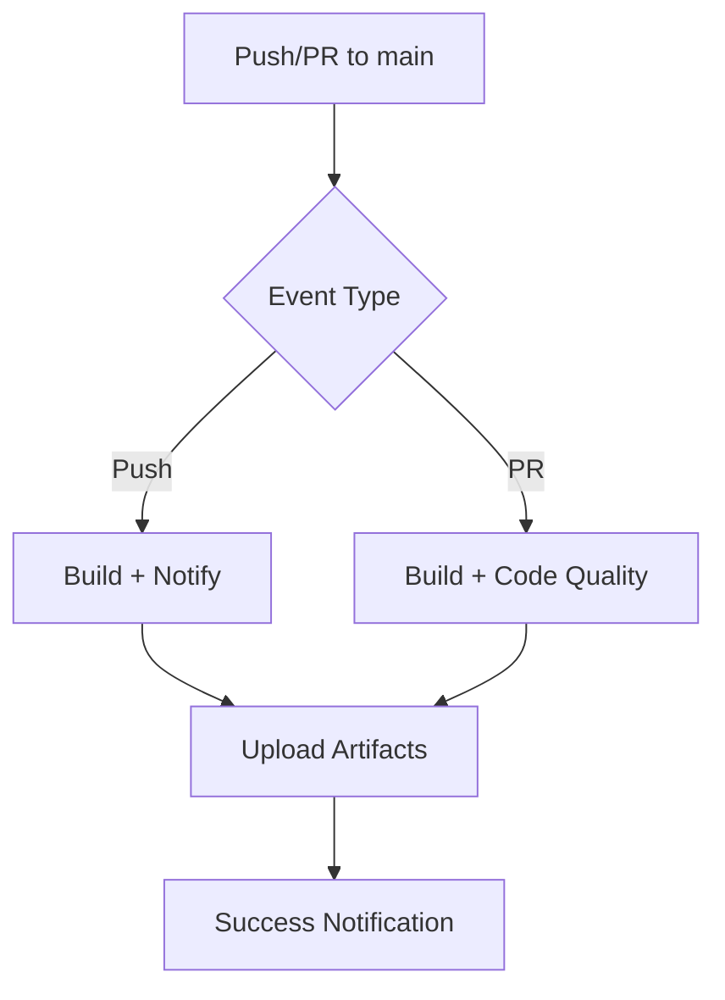

# .github/workflows/ci.yml の詳細説明

## ワークフロー構成

### 1. メインビルドジョブ (build)

**戦略マトリックス:**

- OS: Ubuntu, macOS, Windows
- ビルドタイプ: Debug, Release

**主要ステップ:**

1. **環境セットアップ**

   - ソースコード取得
   - Qt6 キャッシュ設定
   - プラットフォーム別 Qt6 インストール

2. **ビルド実行**

   - CMake 設定 (プラットフォーム別)
   - 並列ビルド実行
   - 実行ファイル存在確認

3. **アーティファクト保存**
   - ビルド成果物を GitHub Actions に保存
   - 7 日間の保持期間設定

### 2. コード品質チェック (code-quality)

**実行条件:** PR のみ

**チェック項目:**

- ソースファイル構造確認
- CMakeLists.txt 構文検証
- ビルドスクリプト存在確認

### 3. 成功通知 (notify-success)

**実行条件:** main ブランチへの push 成功時

## プラットフォーム固有の設定

### Ubuntu

```yaml
sudo apt-get install -y \
qt6-base-dev \
qt6-webengine-dev \
qt6-webengine-dev-tools \
libqt6webenginecore6 \
libqt6webenginewidgets6
```

### macOS

```yaml
brew install qt6 cmake
echo "/opt/homebrew/opt/qt6/bin" >> $GITHUB_PATH
```

### Windows

```yaml
uses: jurplel/install-qt-action@v4
with:
  version: "6.5.*"
  modules: "qtwebengine"
```

## CI 実行フロー



## トラブルシューティング

### よくある問題

1. **Qt6 依存関係エラー**

   - 解決: プラットフォーム固有のパッケージ名確認
   - Ubuntu: `qt6-webengine-dev`
   - macOS: `qt6` (Homebrew)
   - Windows: `qtwebengine` モジュール

2. **CMake 設定エラー**

   - 解決: `CMAKE_BUILD_TYPE`設定確認
   - パス設定 (`Qt6_DIR`) 確認

3. **ビルド並列度問題**
   - 解決: プラットフォーム別 CPU 数検出
   - `nproc`, `sysctl -n hw.ncpu`, デフォルト 4

## カスタマイズポイント

### ビルドマトリックス拡張

```yaml
strategy:
  matrix:
    os: [ubuntu-latest, macos-latest, windows-latest]
    build_type: [Debug, Release]
    qt_version: ["6.5.*", "6.6.*"] # 追加可能
```

### 追加テスト

```yaml
- name: Unit Tests
  run: |
    cd build
    ctest --output-on-failure
```

### 通知設定

```yaml
- name: Slack Notification
  if: failure()
  uses: 8398a7/action-slack@v3
  with:
    status: failure
```
