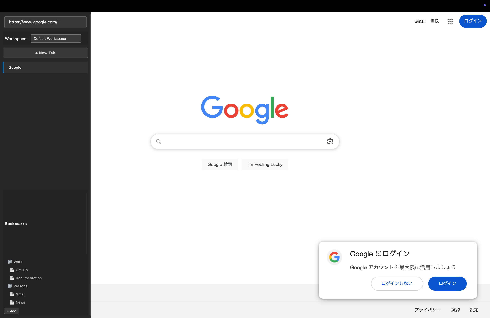
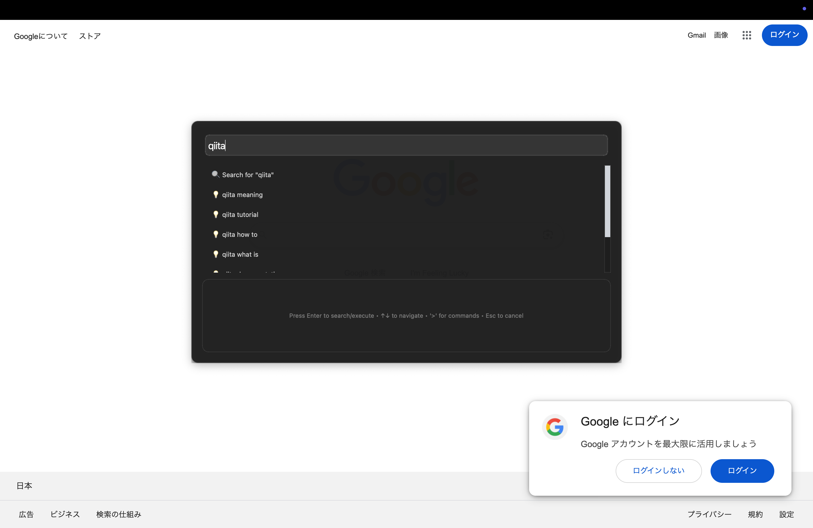
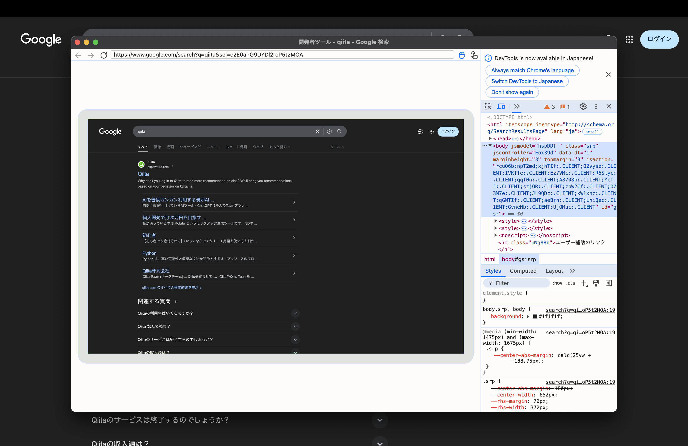

# MyBrowser - Qt WebEngine ブラウザ

ピクチャインピクチャビデオサポート、コマンドパレット、ワークスペース管理などの高度な機能を備えたモダンな Qt ベースの Web ブラウザです。

## 主な機能

- **🎥 ピクチャインピクチャサポート**: ビデオコンテンツの自動 PiP コントロール
- **⌘ コマンドパレット**: クイック検索とコマンド実行（Ctrl+K）
- **📁 ワークスペース管理**: 複数ワークスペースとセッションのサポート
- **📑 高度なタブ管理**: 拡張ナビゲーション付き垂直タブウィジェット
- **🔖 ブックマーク管理**: 整理されたブックマークシステム
- **🎨 モダン UI**: クリーンでレスポンシブなカスタムスタイリングインターフェース

## スクリーンショット

|                   フルスクリーン                    |                    タブバー                    |
| :-------------------------------------------------: | :--------------------------------------------: |
|        |             |
|                **コマンドパレット**                 |                **開発者ツール**                |
|  |  |


## プロジェクト構造

```
mybrowser/
├── src/                           # ソースコード
│   ├── main.cpp                  # アプリケーションエントリーポイント
│   ├── core/                     # コアユーティリティと定数
│   └── features/                 # 機能ベースの組織化
│       ├── main-window/          # メインウィンドウ実装
│       ├── webview/              # Webビューコンポーネント
│       ├── tab-widget/           # タブ管理
│       ├── command-palette/      # コマンドパレット機能
│       ├── workspace/            # ワークスペース管理
│       ├── bookmark/             # ブックマーク管理
│       └── picture-in-picture/   # ピクチャインピクチャ機能
├── tests/                        # テストページとドキュメント
├── scripts/                      # ビルドスクリプト
│   ├── build_debug.sh           # デバッグビルドスクリプト
│   ├── build_release.sh         # リリースビルドスクリプト
├── docs/                         # ドキュメント
├── build/                        # ビルド出力（生成される）
├── resources.qrc                 # Qt リソースファイル
└── CMakeLists.txt               # CMake ビルド設定
```

## アーキテクチャ

アプリケーションは明確な関心の分離を持つ **機能ベースのアーキテクチャ** に従っています：

### コアコンポーネント

- **MainWindow**: 統合 UI 管理を備えた中央アプリケーションウィンドウ
- **WebView**: カスタム JavaScript 注入機能を備えた拡張 Web ビュー
- **VerticalTabWidget**: 垂直レイアウトによるモダンなタブ管理

### 機能マネージャー

各機能は、以下を含む独自のフォルダーに整理されています：

- **C++ マネージャークラス**: ビジネスロジックと Qt 統合
- **CSS ファイル**: 機能固有のスタイリング
- **JavaScript ファイル**: クライアントサイド機能と拡張

#### 機能の構成：

- **🎥 ピクチャインピクチャ**: カスタム API 実装によるビデオ PiP 機能
- **⌘ コマンドパレット**: クイック検索とコマンド実行システム
- **📁 ワークスペース管理**: 複数ワークスペースとセッションサポート
- **🔖 ブックマーク管理**: フォルダサポート付き整理されたブックマークシステム
- **📑 タブ管理**: 垂直レイアウトによる拡張タブナビゲーション
- **🌐 Web ビュー拡張**: カスタム Web ページ拡張と統合

### 機能ベースアーキテクチャの利点：

- **モジュラリティ**: 各機能は自己完結型
- **保守性**: 機能固有のコードの場所特定と変更が容易
- **拡張性**: 新機能の追加が簡単
- **明確な依存関係**: 機能間の相互作用が明示的

### 🎯 サイドバー機能

- **自動非表示**: サイドバーは自動的に非表示（マウスがサイドバー上にある間は表示維持）
- **滑らかなアニメーション**: 250ms のスムーズなスライドアニメーション

### 🔧 UI/UX 機能

- **垂直タブレイアウト**: タブ名の視認性を向上させるサイドバー内配置
- **ダークモード UI**: モダンで目に優しいダークテーマ
- **テキスト色ベースの視認性**: 背景色よりもテキスト色で状態表示
- **統合アドレスバー**: サイドバー内のアドレスバーで直接ナビゲーション

### 🌐 ブラウザ機能

- **ワークスペース管理**: サイドバー内での複数ワークスペース管理
- **統合ブックマーク**: サイドバー内でのブックマークアクセス
- **タブ管理**: タブの作成、削除、切り替え（すべてサイドバー内）
- **ナビゲーション**: 戻る、進む、更新、停止
- **検索機能**: 統合アドレスバーからの直接検索

## キーボードショートカット

| ショートカット | 機能                        |
| -------------- | --------------------------- |
| `Ctrl+S`       | サイドバー表示切り替え      |
| `Ctrl+T`       | コマンドパレット（Google 検索） |
| `Ctrl+W`       | タブを閉じる                |
| `Ctrl+R`       | ページ更新                  |
| `Ctrl+Shift+I` | 開発者ツール                |
| `Ctrl++`       | ズームイン                  |
| `Ctrl+-`       | ズームアウト                |

## 使用方法

### オーバーレイサイドバー

1. **表示**: 画面左端（25px 以内）にマウスを移動
2. **統合アドレスバー**: サイドバー上部で URL 入力とナビゲーション
3. **タブ管理**: サイドバー内でタブの切り替えと新規作成
4. **ブックマーク**: サイドバー下部でブックマークアクセス
5. **自動非表示**: マウスがサイドバーから離れると 3 秒後に非表示
6. **右側検出**: マウスがサイドバー右側（300px 以上）に移動すると自動非表示

### クイック検索

1. `Ctrl+T` を押してクイック検索ダイアログを開く
2. 検索クエリを入力
3. Google 検索が自動実行される

### 改善されたホバー検出

- **左端検出**: 画面左端 25px 以内でサイドバー表示
- **右側検出**: サイドバー右側 300px 以上でサイドバー非表示
- **マウス追跡**: 精密なマウス位置追跡で反応性向上
- **親ウィンドウ統合**: メインウィンドウ全体でマウス追跡

### ワークスペース

- サイドバー内のドロップダウンでワークスペース選択
- タブをワークスペース別に整理可能

## ビルドと実行

### 前提条件

- Qt6 (WebEngine, Widgets)
- CMake 3.16 以上
- C++17 対応コンパイラ

### ビルド手順

```bash
# ビルドディレクトリを作成
mkdir build && cd build

# CMakeでプロジェクトを設定
cmake ..

# ビルド実行
make

# アプリケーション実行
./MyBrowser
```
