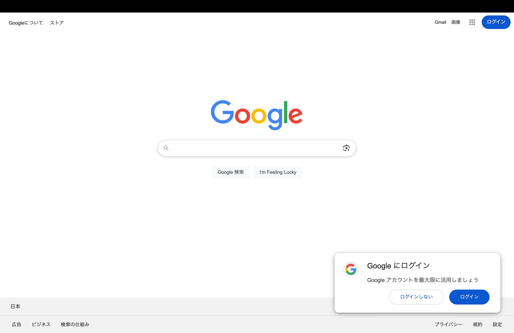
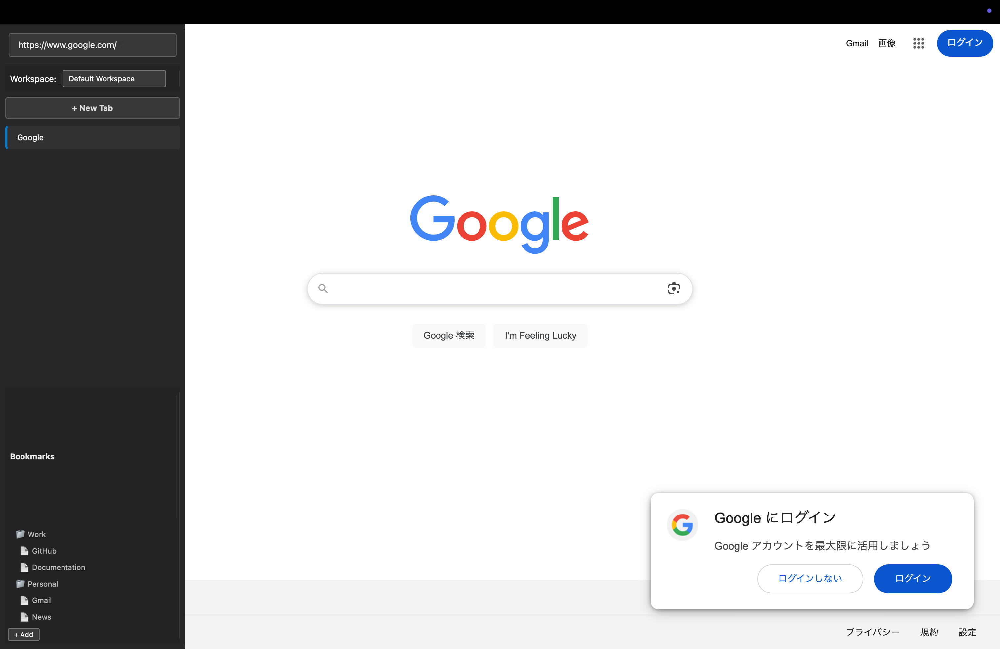
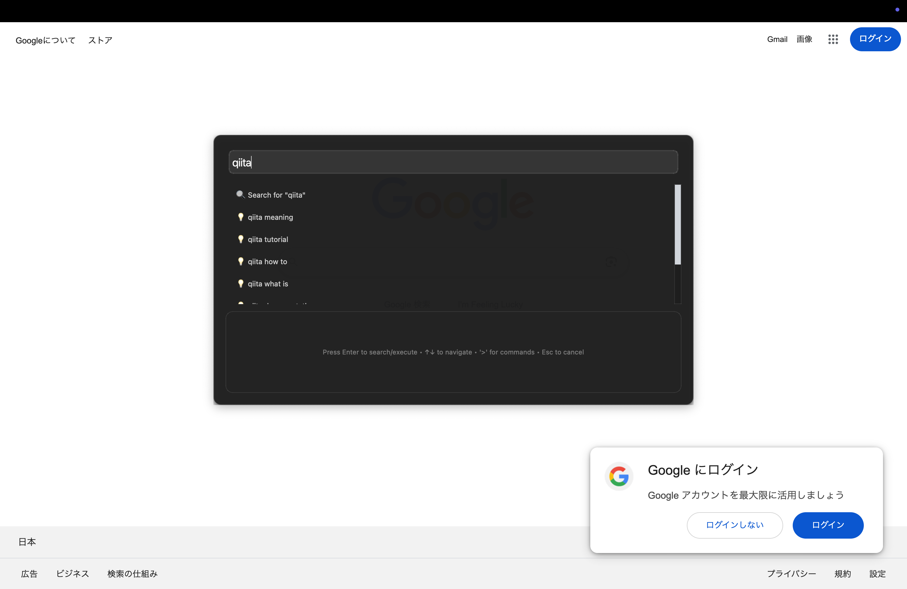
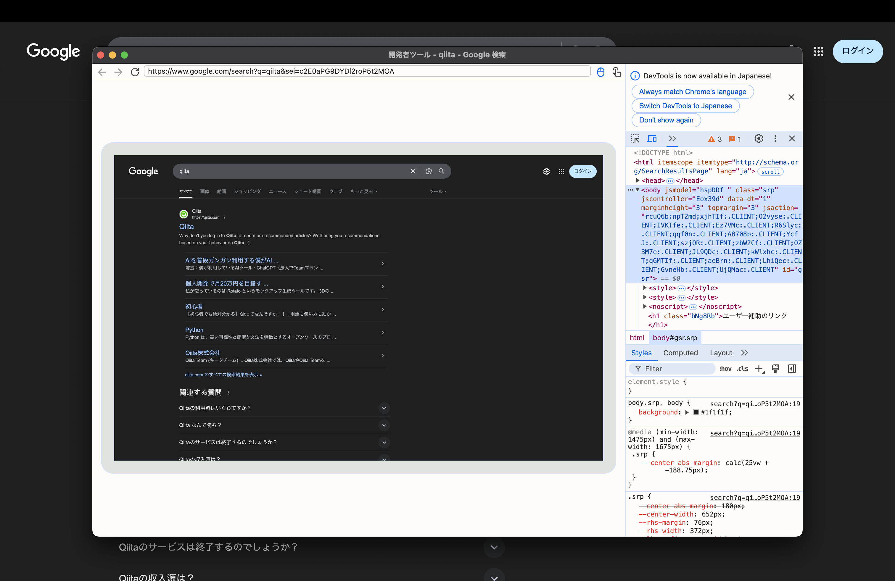

# MyBrowser - Qt WebEngine Browser

A modern Qt-based web browser with advanced features including Picture-in-Picture video support, command palette, and workspace management.

## Features

- **Pi## ビルドと実行eo Support**: Automatic PiP controls for video content
- **Command Palette**: Quick search and command execution (Ctrl+K)
- **Workspace Management**: Multiple workspace and session support
- **Advanced Tab Management**: Vertical tab widget with enhanced navigation
- **Bookmark Management**: Organized bookmark system
- **Modern UI**: Clean, responsive interface with custom styling

## Project Structure

```
mybrowser/
├── src/                           # Source code
│   ├── main.cpp                  # Application entry point
│   ├── core/                     # Core utilities and constants
│   │   └── ui_constants.h        # UI constants and definitions
│   └── features/                 # Feature-based organization
│       ├── main-window/          # Main window implementation
│       │   ├── mainwindow.h/cpp  # Main window class
│       │   └── styles.qss        # Main window styles
│       ├── webview/              # Web view components
│       │   ├── webview.h/cpp     # Enhanced web view implementation
│       │   └── webview-enhancement.js # Web view JavaScript enhancements
│       ├── tab-widget/           # Tab management
│       │   ├── verticaltabwidget.h/cpp # Vertical tab widget
│       │   ├── tab-widget.css    # Tab widget styles
│       │   └── tab-widget.js     # Tab widget JavaScript
│       ├── command-palette/      # Command palette feature
│       │   ├── commandpalettemanager.h/cpp # Command palette manager
│       │   ├── commandpalettedialog.h/cpp  # Command palette dialog
│       │   ├── command-palette.css # Command palette styles
│       │   └── command-palette.js  # Command palette JavaScript
│       ├── workspace/            # Workspace management
│       │   ├── workspacemanager.h/cpp # Workspace manager
│       │   ├── workspace.css     # Workspace styles
│       │   └── workspace.js      # Workspace JavaScript
│       ├── bookmark/             # Bookmark management
│       │   ├── bookmarkmanager.h/cpp # Bookmark manager
│       │   ├── bookmark.css      # Bookmark styles
│       │   └── bookmark.js       # Bookmark JavaScript
│       └── picture-in-picture/   # Picture-in-Picture feature
│           ├── pictureinpicturemanager.h/cpp # PiP manager
│           ├── pip.css           # PiP styles
│           └── pip.js            # PiP JavaScript implementation
├── styles/                       # Application stylesheets
│   └── styles.qss               # Global application styles
├── tests/                        # Test pages and documentation
│   ├── debug_test.html          # Debug test page
│   ├── video_test.html          # Video functionality test
│   ├── pip_test.html            # Picture-in-Picture test
│   ├── pip-test.css             # PiP test styles
│   ├── pip-test.js              # PiP test JavaScript
│   ├── pip_integration_test.html # PiP integration test
│   ├── test_page.html           # General test page
│   └── README.md                # Test documentation
├── scripts/                      # Build scripts
│   ├── build_debug.sh           # Debug build script
│   ├── build_release.sh         # Release build script
│   └── README.md                # Build documentation
├── docs/                         # Documentation
│   ├── README.md                # Documentation overview
│   └── images/                  # Documentation images
│       ├── commandpalette.png
│       ├── developertool.png
│       ├── fullscrean.png
│       └── tabbar.png
├── build/                        # Build output (generated)
├── resources.qrc                 # Qt resource file
└── CMakeLists.txt               # CMake build configuration
```

## Architecture

The application follows a **feature-based architecture** with clear separation of concerns:

### Core Components
- **MainWindow**: Central application window with integrated UI management
- **WebView**: Enhanced web view with custom JavaScript injection capabilities
- **VerticalTabWidget**: Modern tab management with vertical layout

### Feature Managers
Each feature is organized in its own folder containing:
- **C++ Manager Classes**: Business logic and Qt integration
- **CSS Files**: Feature-specific styling
- **JavaScript Files**: Client-side functionality and enhancements

#### Feature Organization:
- **🎥 Picture-in-Picture**: Video PiP functionality with custom API implementation
- **⌘ Command Palette**: Quick search and command execution system
- **📁 Workspace Management**: Multiple workspace and session support
- **🔖 Bookmark Management**: Organized bookmark system with folder support
- **📑 Tab Management**: Enhanced tab navigation with vertical layout
- **🌐 WebView Enhancement**: Custom web page enhancements and integrations

### Benefits of Feature-Based Architecture:
- **Modularity**: Each feature is self-contained
- **Maintainability**: Easy to locate and modify feature-specific code
- **Scalability**: Simple to add new features
- **Code Reusability**: Shared CSS/JS components
- **Clear Dependencies**: Feature interactions are explicit

- **自動非表示**: サイドバーは自動的に非表示（マウスがサイドバー上にある間は表示維持）
- **滑らかなアニメーション**: 250ms のスムーズなスライドアニメーション

|                フルスクリーン                |                タブバー                 |
| :------------------------------------------: | :-------------------------------------: |
|        |             |
|             **コマンドパレット**             |            **開発者ツール**             |
|  |  |

### 🔧 UI/UX 機能

- **垂直タブレイアウト**: タブ名の視認性を向上させるサイドバー内配置
- **ダークモード UI**: モダンで目に優しいダークテーマ
- **テキスト色ベースの視認性**: 背景色よりもテキスト色で状態表示
- **統合アドレスバー**: サイドバー内のアドレスバーで直接ナビゲーション

### 🌐 ブラウザ機能

- **ワークスペース管理**: サイドバー内での複数ワークスペース管理
- **統合ブックマーク**: サイドバー内でのブックマークアクセス
- **タブ管理**: タブの作成、削除、切り替え（すべてサイドバー内）
- **ナビゲーション**: 戻る、進む、更新、停止
- **検索機能**: 統合アドレスバーからの直接検索

## キーボードショートカット

| ショートカット | 機能                        |
| -------------- | --------------------------- |
| `Ctrl+S`       | サイドバー表示切り替え      |
| `Ctrl+T`       | クイック検索（Google 検索） |
| `Ctrl+Shift+T` | 新しいタブ                  |
| `Ctrl+W`       | タブを閉じる                |
| `Ctrl+R`       | ページ更新                  |
| `Ctrl+Shift+I` | 開発者ツール                |
| `Ctrl++`       | ズームイン                  |
| `Ctrl+-`       | ズームアウト                |

## 使用方法

### オーバーレイサイドバー

1. **表示**: 画面左端（25px 以内）にマウスを移動
2. **統合アドレスバー**: サイドバー上部で URL 入力とナビゲーション
3. **タブ管理**: サイドバー内でタブの切り替えと新規作成
4. **ブックマーク**: サイドバー下部でブックマークアクセス
5. **自動非表示**: マウスがサイドバーから離れると 3 秒後に非表示
6. **右側検出**: マウスがサイドバー右側（300px 以上）に移動すると自動非表示

### クイック検索

1. `Ctrl+T` を押してクイック検索ダイアログを開く
2. 検索クエリを入力
3. Google 検索が自動実行される

### 改善されたホバー検出

- **左端検出**: 画面左端 25px 以内でサイドバー表示
- **右側検出**: サイドバー右側 300px 以上でサイドバー非表示
- **マウス追跡**: 精密なマウス位置追跡で反応性向上
- **親ウィンドウ統合**: メインウィンドウ全体でマウス追跡

### ワークスペース

- サイドバー内のドロップダウンでワークスペース選択
- タブをワークスペース別に整理可能

## ビルドと実行

### 前提条件

- Qt6 (WebEngine, Widgets)
- CMake 3.16 以上
- C++17 対応コンパイラ

### ビルド手順

```bash
# ビルドディレクトリを作成
mkdir build && cd build

# CMakeでプロジェクトを設定
cmake ..

# ビルド実行
make

# アプリケーション実行
./MyBrowser
```

## プロジェクト構造

```
mybrowser/
├── src/                    # ソースコード
│   ├── main.cpp           # エントリーポイント
│   ├── mainwindow.*       # メインウィンドウ
│   ├── webview.*          # Webビューコンポーネント
│   ├── verticaltabwidget.* # 垂直タブウィジェット
│   ├── workspacemanager.* # ワークスペース管理
│   ├── bookmarkmanager.*  # ブックマーク管理
│   └── ui_constants.h     # UI定数定義
├── styles/                 # スタイルシート
│   └── styles.qss         # アプリケーションスタイル
├── build/                 # ビルド出力
├── resources.qrc          # Qtリソースファイル
└── CMakeLists.txt         # CMakeビルド設定
```

## UI 改善点

### 1. オーバーレイサイドバーシステム

- **イベントフィルタリング**: 親ウィンドウでのマウス追跡
- **精密ホバー検出**: 25px の左端検出ゾーン
- **右側境界検出**: 300px を超えると自動非表示
- **スムーズアニメーション**: QPropertyAnimation で 250ms のスライド

### 2. クイック検索機能

- `Ctrl+T` で Google 検索ダイアログ
- URL エンコーディングで安全な検索クエリ
- 現在タブまたは新規タブでの検索結果表示

### 3. タブの視認性向上

- 垂直レイアウトでタブ名を完全表示
- ダークテーマで目への負担軽減
- テキスト色変更による状態表示

### 4. ワークスペース UI 改善

- サイドバー内統合ワークスペースツールバー
- グラデーション背景とモダンなボタンデザイン
- 色分けされたアクション（削除は赤色）

### 5. 統合ブックマーク

- サイドバー内ブックマークパネル
- フォルダー構造のサポート
- ワンクリックでのブックマークナビゲーション

### 6. マウス追跡の改善

- `setMouseTracking(true)` で連続追跡
- eventFilter での親ウィンドウ監視
- 複数レベルでのホバー検出

### 4. 全体的なスタイリング

- 統一された色彩設計
- アクセシビリティを考慮したコントラスト
- モダンなフラットデザイン

## 今後の改善予定

- [ ] タブドラッグ&ドロップ機能
- [ ] カスタムテーマ設定
- [ ] プラグインシステム
- [ ] より詳細な履歴管理
- [ ] パフォーマンス最適化
