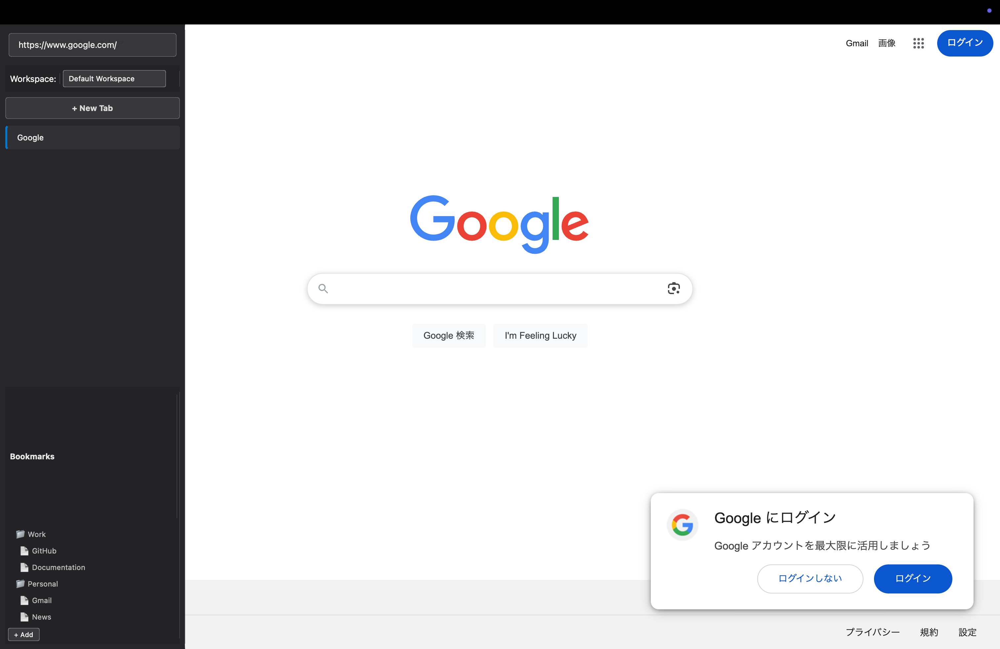
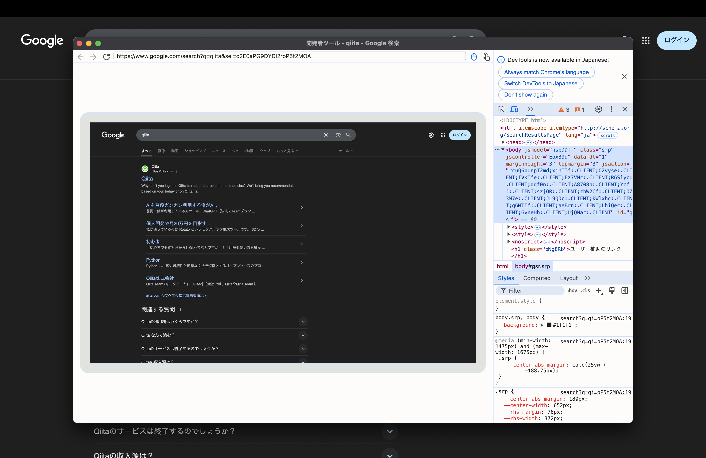

# MyBrowser Documentation

## Overview

MyBrowser is a Qt WebEngine-based browser with advanced features including Picture-in-Picture video support, command palette, and workspace management.

## Screenshots

### Main Interface

### Developer Tools

### Full Screen Mode

### Command Palette

## Features

### Picture-in-Picture Support

- Automatic removal of `disablepictureinpicture` attributes
- Menu integration for PiP controls
- Command palette integration
- Comprehensive JavaScript API support

### Command Palette

- Quick search functionality
- Command execution
- History management
- Keyboard shortcuts

### Workspace Management

- Multiple workspace support
- Session management
- Bookmark organization

## Architecture

### Core Components

- `MainWindow`: Main application window and UI coordination
- `WebView`: Enhanced web view with media features
- `PictureInPictureManager`: Dedicated PiP functionality
- `CommandPaletteManager`: Command palette and search features
- `WorkspaceManager`: Workspace and session management
- `BookmarkManager`: Bookmark organization and management

### Manager Pattern

The application uses a manager pattern to separate concerns:

- Each major feature has its own dedicated manager class
- Managers handle initialization, UI integration, and feature logic
- MainWindow coordinates between managers

## Building and Testing

See the scripts directory for build instructions and the tests directory for test pages.
